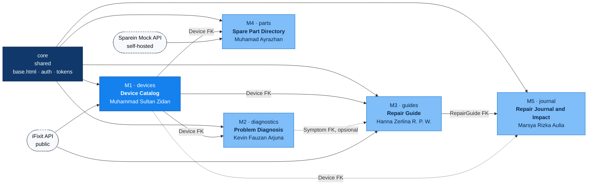
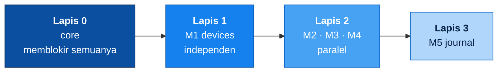
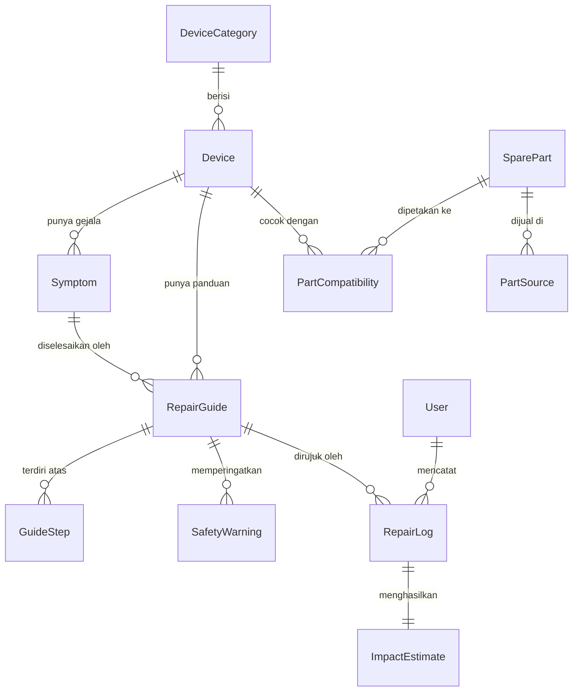
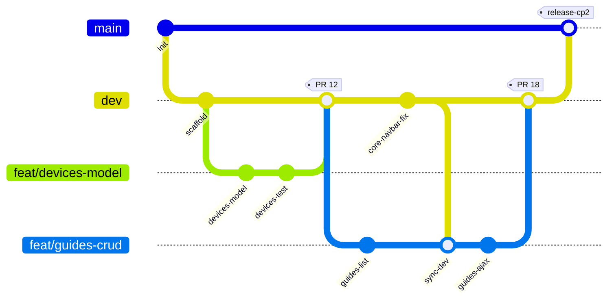
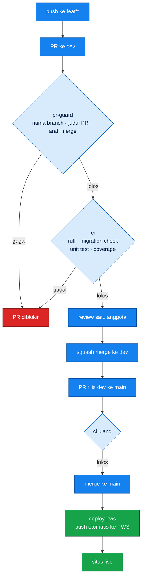
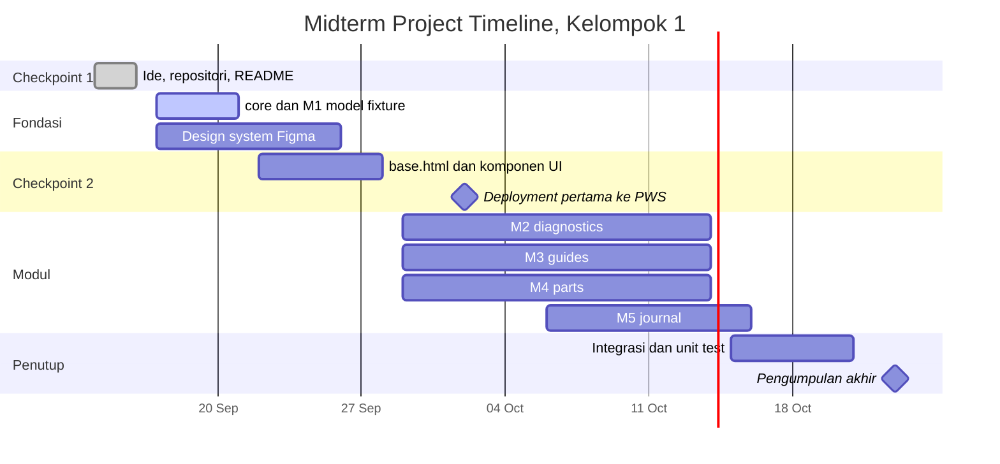
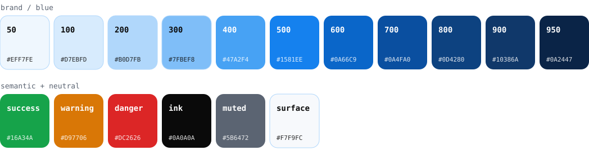

<p align="center">
  <picture>
    <source media="(prefers-color-scheme: dark)" srcset="docs/brand/sparein-lockup-dark.svg">
    
  </picture>
</p>

<p align="center"><em>Repair first, discard last.</em></p>

<p align="center">
  <a href="../../actions/workflows/ci.yml"></a>
  <a href="../../actions/workflows/deploy-pws.yml"></a>
  
  
  
</p>

---

## Overview

**Sparein** adalah platform panduan perbaikan barang dan direktori suku cadang untuk pengguna Indonesia.

Setiap tahun Indonesia membuang lebih dari dua juta ton limbah elektronik. Sebagian besar barang itu sebenarnya masih bisa diperbaiki. Yang hilang bukan kemampuan, melainkan informasi: pemiliknya tidak tahu apa yang rusak, tidak tahu langkah perbaikannya, dan tidak tahu suku cadangnya dijual di mana. Di luar negeri peran itu diisi iFixit; di Indonesia belum ada padanannya.

Sparein menutup jarak tersebut lewat satu alur: **cari perangkat, diagnosa gejala, ikuti panduan, temukan suku cadang, catat hasilnya**. Setiap perbaikan yang berhasil dicatat pengguna dihitung sebagai barang yang tidak jadi masuk tempat sampah, lengkap dengan estimasi berat limbah dan biaya yang terhindar.

Manfaat bagi masyarakat: memperpanjang umur pakai barang, menekan limbah elektronik rumah tangga, menghemat pengeluaran, dan mendorong budaya perbaikan yang selama ini hanya hidup di komunitas kecil.

**Tema:** Sustainable Living. **Sub-tema:** Waste Management (e-waste) dan Conscious Shopping.

> Di luar cakupan versi ini: transaksi jual-beli. Sparein berhenti di informasi dan rujukan suku cadang, tanpa keranjang belanja maupun pembayaran. Keputusan ini diambil agar lingkup Proyek Tengah Semester tetap tuntas.

---

## Team & Module PIC

Kelompok 1, Pemrograman Berbasis Platform (CSGE602022), Gasal 2026/2027.

| NPM | Name | Module (PIC) |
|---|---|---|
| 2506534876 | Muhammad Sultan Zidan | M1 Device Catalog |
| 2506612266 | Kevin Fauzan Arjuna | M2 Problem Diagnosis |
| 2506594692 | Hanna Zerlina Razaq Putri Wicaksono | M3 Repair Guide |
| 2506586236 | Muhamad Ayrazhan | M4 Spare Part Directory |
| 2506537606 | Marsya Rizka Aulia | M5 Repair Journal & Impact |

---

## Module Map

Setiap anggota memegang **satu Django app** dan bertanggung jawab penuh atas CRUD di dalamnya. `core` adalah fondasi bersama: layout, autentikasi, dan design token.



Garis penuh berarti dependency wajib. Garis putus-putus berarti dependency opsional: modul tetap jalan tanpanya.

### Build Order



M1 memblokir tiga modul sekaligus, jadi urutannya bukan sekadar saran. Supaya Lapis 2 tidak perlu menunggu M1 selesai, **M1 wajib merge model, migration, dan fixture `devices/fixtures/seed_devices.json` paling lambat 21 September 2026**. Setelah fixture itu ada, M2, M3, dan M4 bisa jalan paralel tanpa menyentuh kode M1.

### Module Breakdown

| Module | Django app | Main models | Depends on | Exported to other modules |
|---|---|---|---|---|
| M1 Device Catalog | `devices` | `DeviceCategory`, `Device` | tidak ada | `Device` FK, `get_device_qs()`, `GET /api/devices/` |
| M2 Problem Diagnosis | `diagnostics` | `Symptom`, `DiagnosisSession`, `DiagnosisResult` | M1 | `Symptom` FK, `GET /api/symptoms/?device=` |
| M3 Repair Guide | `guides` | `RepairGuide`, `GuideStep`, `SafetyWarning` | M1, M2 (opsional) | `RepairGuide` FK, `GET /api/guides/` |
| M4 Spare Part Directory | `parts` | `SparePart`, `PartCompatibility`, `PartSource` | M1 | `GET /api/parts/?device=` |
| M5 Repair Journal & Impact | `journal` | `RepairLog`, `ImpactEstimate` | M3, M1 (opsional) | konsumen akhir, tidak diekspor |

Masing-masing modul memenuhi seluruh kewajiban per anggota: Models, Views (HTML dan JSON) untuk empat operasi CRUD, Form, template yang mewarisi `base.html`, interaktivitas AJAX, filter berbasis autentikasi, dan filter atas data yang berasal dari API eksternal.

Kontrak antarmodul yang lebih rinci, termasuk field, nama fungsi, dan aturan siapa boleh mengubah apa, ada di [`docs/MODULES.md`](docs/MODULES.md).

### Module Boundary Rules

1. Modul lain diakses lewat **FK dan fungsi selector yang diekspor**, tidak pernah lewat query langsung ke tabel milik orang lain.
2. Satu orang hanya membuat migration di app miliknya. Migration milik orang lain tidak pernah diedit.
3. Perubahan pada `core/` butuh **dua approval** karena menyentuh semua orang.
4. Perubahan yang memutus kontrak modul lain diumumkan lewat Issue berlabel `breaking` sebelum PR dibuka.

---

## Data Model



---

## Public API & Mock API

| Source | Type | Used by | Docs |
|---|---|---|---|
| iFixit API 2.0 | Public API eksternal, tanpa API key | M1, M3 | <https://www.ifixit.com/api/2.0/doc> |
| Sparein Mock API | Mock API buatan kelompok | M4 | `docs/MOCK-API.md`, menyusul di Checkpoint 2 |

**iFixit API 2.0** menyediakan katalog perangkat dan panduan perbaikan terbuka.

| Endpoint | Returns | Mapped to |
|---|---|---|
| `GET /api/2.0/wikis/CATEGORY?limit=&offset=` | daftar kategori perangkat, judul, gambar, ringkasan | `Device`, `DeviceCategory` |
| `GET /api/2.0/guides?limit=&offset=` | panduan beserta `difficulty`, `time_required`, `type` | `RepairGuide` |
| `GET /api/2.0/guides/{guideid}` | langkah per panduan dan catatan keselamatan | `GuideStep`, `SafetyWarning` |

Data ditarik lewat management command `seed_devices`, lalu disimpan ke database sebagai initial data dengan minimal 50 perangkat utama saat deployment. Respons juga di-cache supaya halaman tidak bergantung pada ketersediaan API saat demo.

**Mock API** dibutuhkan karena tidak ada Public API untuk harga dan ketersediaan suku cadang di Indonesia. Kelompok menerbitkan sendiri endpoint JSON di luar repositori proyek, lalu M4 mengonsumsinya lewat HTTP seperti API pihak ketiga, bukan sebagai data statis yang ditulis langsung di dalam kode.

---

## User Roles

| Role | Access |
|---|---|
| **Visitor**, belum login | Cari perangkat, baca ringkasan panduan, lihat katalog suku cadang tanpa harga dan tanpa kontak penjual |
| **Member**, pengguna terdaftar | Semua hak Visitor, ditambah langkah panduan lengkap, harga dan kontak penjual, jurnal perbaikan pribadi, dan simpan panduan |
| **Contributor**, member terverifikasi | Semua hak Member, ditambah menulis dan menyunting panduan serta mendaftarkan suku cadang |
| **Admin** | Moderasi seluruh konten, verifikasi Contributor, kelola kategori perangkat |

Kolom yang dibatasi, yaitu `PartSource.price`, `PartSource.contact`, dan `GuideStep.detail`, difilter di level queryset, bukan disembunyikan lewat CSS.

---

## Git Workflow

`main` tidak pernah disentuh langsung. Semua pekerjaan berangkat dari `dev` dan kembali ke `dev` lewat Pull Request.



| Branch | Role | Protection |
|---|---|---|
| `main` | Rilis. Isinya persis yang berjalan di PWS. | PR wajib, satu approval, CI hijau, admin tidak bisa bypass. Hanya menerima merge dari `dev`. |
| `dev` | Branch default, tempat semua modul terintegrasi. | PR wajib, satu approval, CI hijau. |
| `feat/*`, `fix/*`, `chore/*`, `docs/*`, `test/*` | Satu branch satu pekerjaan, dibuat dari `dev`. | tidak ada |

Aturan yang dijalankan otomatis oleh CI:

- Nama branch mengikuti pola `<type>/<modul>-<slug>`, contoh `feat/guides-safety-warning`.
- Judul PR mengikuti Conventional Commits, contoh `feat(guides): add safety warning list`.
- PR ke `main` hanya diterima kalau sumbernya `dev`.
- Merge memakai **squash merge**, jadi riwayat `dev` tetap satu commit per PR.
- PR yang masih berjalan ditandai **Draft**. PR siap-review berarti fiturnya sudah selesai dan tesnya lulus, bukan sekadar checkpoint harian.

Langkah operasional lengkap ada di [`CONTRIBUTING.md`](CONTRIBUTING.md).

---

## CI/CD



| Workflow | Trigger | Does |
|---|---|---|
| [`pr-guard.yml`](.github/workflows/pr-guard.yml) | PR dibuka atau diperbarui | Validasi nama branch, judul PR, dan arah merge |
| [`ci.yml`](.github/workflows/ci.yml) | PR ke `dev` atau `main`, push ke `dev` | `ruff`, `makemigrations --check`, unit test, laporan coverage, cek kelengkapan README |
| [`deploy-pws.yml`](.github/workflows/deploy-pws.yml) | push ke `main` | Push otomatis ke PWS memakai secret `PWS_URL` |

Kredensial PWS disimpan sebagai repository secret bernama `PWS_URL` dan tidak pernah masuk ke dalam kode.

---

## Timeline



---

## Risk & Mitigation

| # | Risk | Impact | Mitigation already in place |
|---|---|---|---|
| R1 | M1 terlambat sehingga tiga modul ikut tertahan | Tinggi | Model, migration, dan fixture `seed_devices.json` wajib merge 21 September. Modul lain bekerja di atas fixture, bukan menunggu M1 rampung. |
| R2 | iFixit API mati atau kena rate limit saat demo | Tinggi | Data ditarik sekali lalu disimpan ke database, respons di-cache, dan snapshot fixture ikut masuk repositori. |
| R3 | Konflik merge di `core/` dan `base.html` | Sedang | `core/` dijaga CODEOWNERS dan butuh dua approval. Modul lain hanya boleh menambah blok ``. |
| R4 | Deployment PWS baru dicoba di minggu terakhir | Tinggi | CD aktif sejak Checkpoint 2, setiap merge ke `main` langsung dideploy. |
| R5 | Anggota berhalangan | Sedang | Tiap modul punya satu backup reviewer yang sudah membaca kodenya sejak awal. |
| R6 | Migration bercabang karena dikerjakan paralel | Sedang | Satu app satu orang, dan `makemigrations --check --dry-run` gagal di CI kalau ada model yang belum termigrasi. |
| R7 | Coverage di bawah 80% menjelang tenggat | Sedang | Coverage dilaporkan tiap PR sejak awal, bukan diukur di akhir. |
| R8 | Kredensial PWS terbawa ke repositori | Tinggi | `PWS_URL` hanya hidup sebagai repository secret, `.env` masuk `.gitignore`, dan secret scanning aktif. |
| R9 | PR menumpuk tanpa review | Sedang | SLA review 24 jam, dan PR yang belum selesai wajib Draft sehingga tidak masuk antrean. |

Rincian pemilik risiko dan pemicunya ada di [`docs/RISKS.md`](docs/RISKS.md).

---

## Design System

Palet berangkat dari biru logo Sparein, `#1581EE`, dikembangkan menjadi satu ramp 50 sampai 950 plus warna semantik.

<p align="center"></p>

| Token | Hex | Usage |
|---|---|---|
| `--blue-500` | `#1581EE` | Warna utama, tombol primer, tautan |
| `--blue-700` | `#0A4FA0` | Hover dan heading |
| `--blue-50` | `#EFF7FE` | Latar bagian dan kartu |
| `--success` | `#16A34A` | Perbaikan berhasil dan dampak positif |
| `--warning` | `#D97706` | Peringatan keselamatan |
| `--danger` | `#DC2626` | Langkah berisiko dan aksi destruktif |
| `--ink` | `#0A0A0A` | Teks utama |
| `--muted` | `#5B6472` | Teks sekunder |

Framework CSS: **Tailwind CSS**, dengan token di atas dipetakan ke `theme.extend.colors`. Skala tipografi, komponen, dan aturan pemakaian ada di [`docs/DESIGN-SYSTEM.md`](docs/DESIGN-SYSTEM.md).

---

## Local Setup

```bash
git clone https://github.com/Kelompok1-PBP/sparein.git
cd sparein
git checkout dev

python -m venv env
source env/bin/activate        # Windows: env\Scripts\activate

pip install -r requirements.txt
cp .env.example .env           # isi kredensial database
python manage.py migrate
python manage.py seed_devices  # tarik initial data dari iFixit API
python manage.py runserver
```

---

## Links

| | |
|---|---|
| Repositori | <https://github.com/Kelompok1-PBP/sparein> |
| Deployment PWS | menyusul di Checkpoint 2 |
| Desain Figma | menyusul di Checkpoint 2 |
| Panduan kontribusi | [`CONTRIBUTING.md`](CONTRIBUTING.md) |
| Kontrak modul | [`docs/MODULES.md`](docs/MODULES.md) |
| Design system | [`docs/DESIGN-SYSTEM.md`](docs/DESIGN-SYSTEM.md) |
| Daftar risiko | [`docs/RISKS.md`](docs/RISKS.md) |

---

<p align="center"><sub>Kelompok 1 · Pemrograman Berbasis Platform · Fakultas Ilmu Komputer, Universitas Indonesia · Gasal 2026/2027</sub></p>
