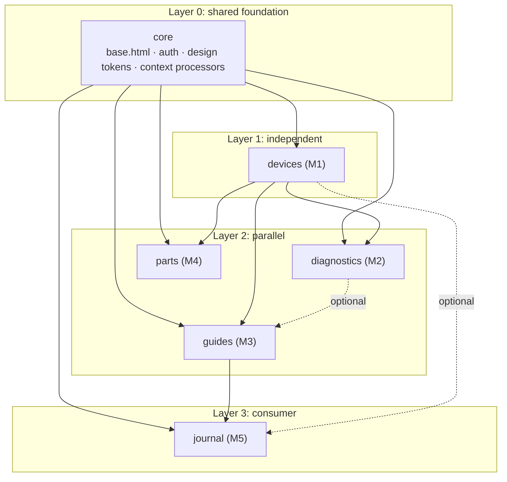

# Module Contracts

Five members, five Django apps, one shared `core`. This file is the source of truth for what each module owns, what it depends on, and what it promises to the rest of the team. Change the contract and this file in the same pull request.

## Dependency layers



`devices` is the only module with no upstream dependency, and three modules depend on it. That makes it the critical path.

**Unblocking rule.** `devices` merges its models, migration, and `devices/fixtures/seed_devices.json` by **21 September 2026**. From that point Layer 2 loads the fixture and builds against a stable `Device` shape, so no one waits for M1 to finish its views, templates, or AJAX work.

---

## core (shared foundation)

Owner: whole team. Changes require two approvals via CODEOWNERS.

| Provides | Detail |
|---|---|
| `templates/base.html` | ``, ``, `` |
| `templates/partials/` | `header.html`, `footer.html`, `card.html`, `empty_state.html` |
| Auth | `django.contrib.auth` plus `UserProfile` carrying `role` |
| `core.permissions` | `is_member`, `is_contributor`, `is_admin` |
| Design tokens | Tailwind config mapping the palette in [`DESIGN-SYSTEM.md`](DESIGN-SYSTEM.md) |

Roles: `VISITOR` (anonymous), `MEMBER`, `CONTRIBUTOR`, `ADMIN`.

Other modules extend `base.html` and add blocks. They do not edit it.

---

## M1. devices (Device Catalog)

Owner: Muhammad Sultan Zidan (2506534876). Depends on: `core`.

### Models

| Model | Key fields |
|---|---|
| `DeviceCategory` | `name`, `slug`, `parent` (self FK, nullable) |
| `Device` | `name`, `slug`, `category` FK, `brand`, `release_year`, `image_url`, `summary`, `ifixit_wikiid`, `repairability_score`, `created_by` FK, `created_at` |

### CRUD surface

| Operation | Route | Access |
|---|---|---|
| Create | `POST /devices/create/` | Contributor |
| Read | `GET /devices/`, `GET /devices/<slug>/` | Visitor |
| Update | `POST /devices/<slug>/edit/` | Contributor, owner or Admin |
| Delete | `POST /devices/<slug>/delete/` | Admin |
| JSON | `GET /api/devices/?q=&category=&brand=` | Visitor |

### Exported contract

```python
# devices/selectors.py
def get_device_qs(*, q=None, category=None, brand=None): ...
def get_device_or_404(slug: str) -> Device: ...
```

Other modules import these two functions and the `Device` model. Nothing else in `devices` is public.

### External data

`GET https://www.ifixit.com/api/2.0/wikis/CATEGORY?limit=&offset=` seeds at least 50 devices through `manage.py seed_devices`. Responses are cached and a snapshot ships as a fixture, so a dead upstream never breaks a demo.

---

## M2. diagnostics (Problem Diagnosis)

Owner: Kevin Fauzan Arjuna (2506612266). Depends on: `core`, `devices`.

### Models

| Model | Key fields |
|---|---|
| `Symptom` | `device` FK, `title`, `slug`, `description`, `severity`, `created_by` FK |
| `DiagnosisSession` | `user` FK (nullable for anonymous), `device` FK, `created_at` |
| `DiagnosisResult` | `session` FK, `symptom` FK, `likelihood`, `note` |

A session collects the symptoms a user ticks for one device and returns ranked likely causes.

### CRUD surface

| Operation | Route | Access |
|---|---|---|
| Create | `POST /diagnostics/symptoms/create/` | Contributor |
| Read | `GET /diagnostics/?device=`, `GET /diagnostics/<slug>/` | Visitor |
| Update | `POST /diagnostics/<slug>/edit/` | Contributor, owner or Admin |
| Delete | `POST /diagnostics/<slug>/delete/` | Admin |
| JSON | `GET /api/symptoms/?device=&severity=` | Visitor |

AJAX: ticking a symptom updates the ranked result list without a page reload.

### Exported contract

```python
# diagnostics/selectors.py
def get_symptoms_for_device(device_id: int): ...
```

`guides` may link a `RepairGuide` to a `Symptom`. The link is nullable, so `guides` ships with or without M2.

---

## M3. guides (Repair Guide)

Owner: Hanna Zerlina Razaq Putri Wicaksono (2506594692). Depends on: `core`, `devices`, optionally `diagnostics`.

### Models

| Model | Key fields |
|---|---|
| `RepairGuide` | `device` FK, `symptom` FK (nullable), `title`, `slug`, `summary`, `difficulty`, `time_required_minutes`, `tools`, `ifixit_guideid`, `author` FK, `published` |
| `GuideStep` | `guide` FK, `order`, `title`, `detail`, `image_url` |
| `SafetyWarning` | `guide` FK, `level` (`info`, `caution`, `danger`), `message` |

`difficulty` uses the iFixit scale: `Very easy`, `Easy`, `Moderate`, `Difficult`, `Very difficult`.

### CRUD surface

| Operation | Route | Access |
|---|---|---|
| Create | `POST /guides/create/` | Contributor |
| Read | `GET /guides/?device=&difficulty=&max_time=`, `GET /guides/<slug>/` | Visitor, steps truncated |
| Update | `POST /guides/<slug>/edit/` | Contributor, author or Admin |
| Delete | `POST /guides/<slug>/delete/` | Author or Admin |
| JSON | `GET /api/guides/?device=&difficulty=` | Visitor |

Auth filter: a Visitor sees the summary, difficulty, time estimate, and every `SafetyWarning`. `GuideStep.detail` is returned to Members and above only. Safety warnings are never gated.

### Exported contract

```python
# guides/selectors.py
def get_guide_qs(*, device=None, difficulty=None, max_time=None): ...
def get_guide_or_404(slug: str) -> RepairGuide: ...
```

### External data

`GET https://www.ifixit.com/api/2.0/guides` and `GET https://www.ifixit.com/api/2.0/guides/{guideid}` supply `difficulty`, `time_required`, and step text.

---

## M4. parts (Spare Part Directory)

Owner: Muhamad Ayrazhan (2506586236). Depends on: `core`, `devices`.

Information and referral only. No cart, no checkout, no payment.

### Models

| Model | Key fields |
|---|---|
| `SparePart` | `name`, `slug`, `part_number`, `category`, `description`, `image_url` |
| `PartCompatibility` | `part` FK, `device` FK, `note`, unique together |
| `PartSource` | `part` FK, `vendor_name`, `city`, `price`, `currency`, `url`, `contact`, `last_checked` |

### CRUD surface

| Operation | Route | Access |
|---|---|---|
| Create | `POST /parts/create/` | Contributor |
| Read | `GET /parts/?device=&category=&max_price=`, `GET /parts/<slug>/` | Visitor, price and contact hidden |
| Update | `POST /parts/<slug>/edit/` | Contributor, owner or Admin |
| Delete | `POST /parts/<slug>/delete/` | Admin |
| JSON | `GET /api/parts/?device=&max_price=` | Visitor |

Auth filter: `PartSource.price` and `PartSource.contact` are excluded from the queryset for anonymous users. Excluding at the queryset level, not in the template, keeps the JSON endpoint honest too.

### External data

Indonesia has no public spare-part API, so the team publishes its own mock API outside this repository and consumes it over HTTP. The endpoint and schema are recorded in `docs/MOCK-API.md` by Checkpoint 2.

---

## M5. journal (Repair Journal & Impact)

Owner: Marsya Rizka Aulia (2506537606). Depends on: `core`, `guides`, optionally `devices`.

### Models

| Model | Key fields |
|---|---|
| `RepairLog` | `user` FK, `guide` FK (nullable), `device` FK (nullable), `title`, `status` (`planned`, `in_progress`, `succeeded`, `failed`), `cost_spent`, `notes`, `repaired_at` |
| `ImpactEstimate` | `log` OneToOne, `waste_avoided_kg`, `cost_avoided`, `computed_at` |

`ImpactEstimate` is derived from the device category's average mass and replacement cost, then aggregated into a personal dashboard and a site-wide counter.

### CRUD surface

| Operation | Route | Access |
|---|---|---|
| Create | `POST /journal/create/` | Member |
| Read | `GET /journal/`, `GET /journal/<id>/` | Member, own records only |
| Update | `POST /journal/<id>/edit/` | Member, owner only |
| Delete | `POST /journal/<id>/delete/` | Member, owner only |
| JSON | `GET /api/journal/summary/` | Member |

Auth filter: the entire module is login-only, and every queryset is filtered by `user=request.user`. A Visitor sees the aggregate site-wide impact counter and nothing else.

---

## Cross-module rules

1. Import across modules only through `<app>/selectors.py` and the models named above.
2. Migrations stay inside the owning app. Nobody edits another member's migration.
3. Contract changes need an Issue labelled `breaking` before the pull request, and this file updated in that same pull request.
4. Every module extends `core/templates/base.html` and adds blocks rather than editing it.
5. Every module ships its own `tests.py` covering all four CRUD operations plus its auth filter.
